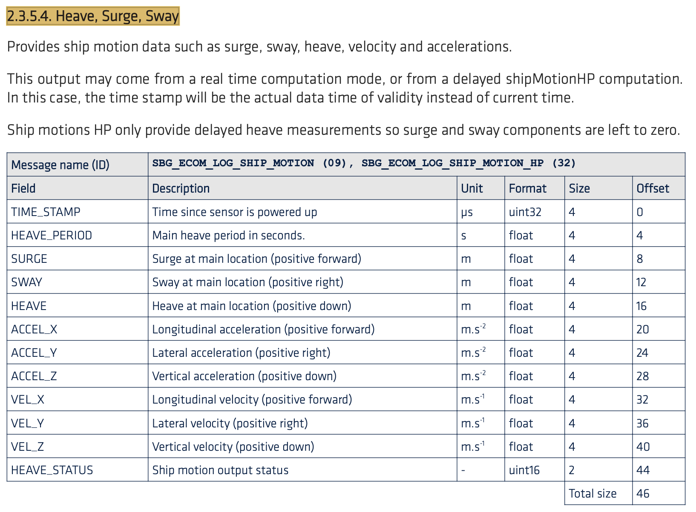

# sbgECom Ship Motion frame
Programme Arduino de décodage d'une trame sbgECom produite par une centrale inertielle [SBG modèle Ellipse](https://www.sbg-systems.com/fr/produits/ellipse-series/).

Ce repository a été créé à l'aide de la documentation du firmware fournie par SBG : [sbgECom firmware reference manual](https://support.sbg-systems.com/sc/dev/latest/firmware-documentation)

Le code [sbgEcom_shipMotion_receiver.ino](sbgEcom_shipMotion_receiver.ino) donné, **traite uniquement la partie Ship Motion** (Heave, Surge, Sway) de la trame.

## Composition d'une trame sbgECom
| Field       |   SYNC1    |   SYNC2    |     MSG      |    CLASS    |LEN|DATA|CRC|ETX|
| ----------- |:----------:|:----------:|:------------:|:-----------:|:---:|:---:|:---:|:---:|
| Size in Bytes       |     1      |     1      |      1       |      1      |2|46|2|1|
| Desc. | Sync. Word | Sync. Word |   Mess. ID   | Mess. Class |Len. of data|Payload|16bits CRC|EoF|
| Value       |    0xFF    |    0x5A    | 0x09 |    0x00     |46 : 0x2E|

- La taille totale de la trame est de **55 octets**
- **MSG = 0x09** pour un payload contenant les informations Ship Motion de la centrale.
- **CLASS = 0x00** pour un payload qui contient des messages de logs, soit les relevés des mesures de la centrale.
- **LEN = 0x2E** pour la taille du payload, dans le cas des données Ship Motion : 46 octets.

## Composition du payload Ship Motion (Heave, Surge, Sway)
SBG fournit dans la documentation du firmware le contenu du payload (**partie DATA de la trame sbgECom**) ship motion :

|N° Octet|Type|
|:---:|:---:|
|0 à 5|Préfixe (SYNC1 + SYNC2 + MSG + CLASS + LEN)|
|6 à 9|TIME_STAMP|
|10 à 13|HEAVE_PERIOD|
|14 à 17|SURGE|
|18 à 21|SWAY|
|22 à 25|HEAVE|

Le code [sbgEcom_shipMotion_receiver.ino](sbgEcom_shipMotion_receiver.ino) donné récupère et affiche les valeurs HEAVE_PERIOD et HEAVE renvoyées par la centrale.
